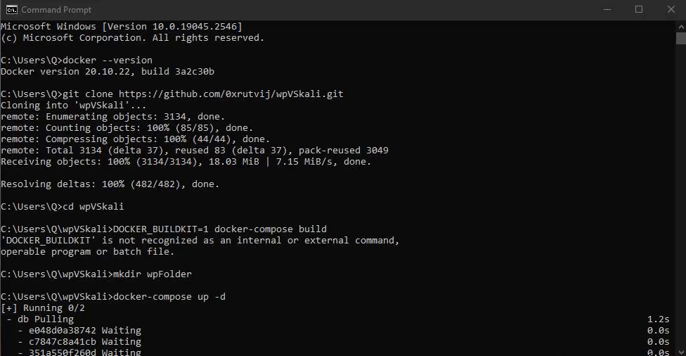

# CodePath_Unit-3-Project-Virtualization-and-Kali-Linux


# Project 3 - Kali

Time spent: **2** hours spent in total

**Homework Instructions**: 

- [ ] Create a GIF recording of you running the following command block in your Kali Terminal. Copy it to a text editor first and **replace the first 2 variables, name and univ, with your real name and college name**, then copy/paste the code block into a Terminal. 

```bash
name="Aaron Steig"
univ="Florida Atlantic University"

screenfetch
echo $name'@'$univ
```

Save the file as **screenfetch.gif**.

**Challenges and Problems**: 

### Running screenfetch (PUT YOUR GIF BELOW)



